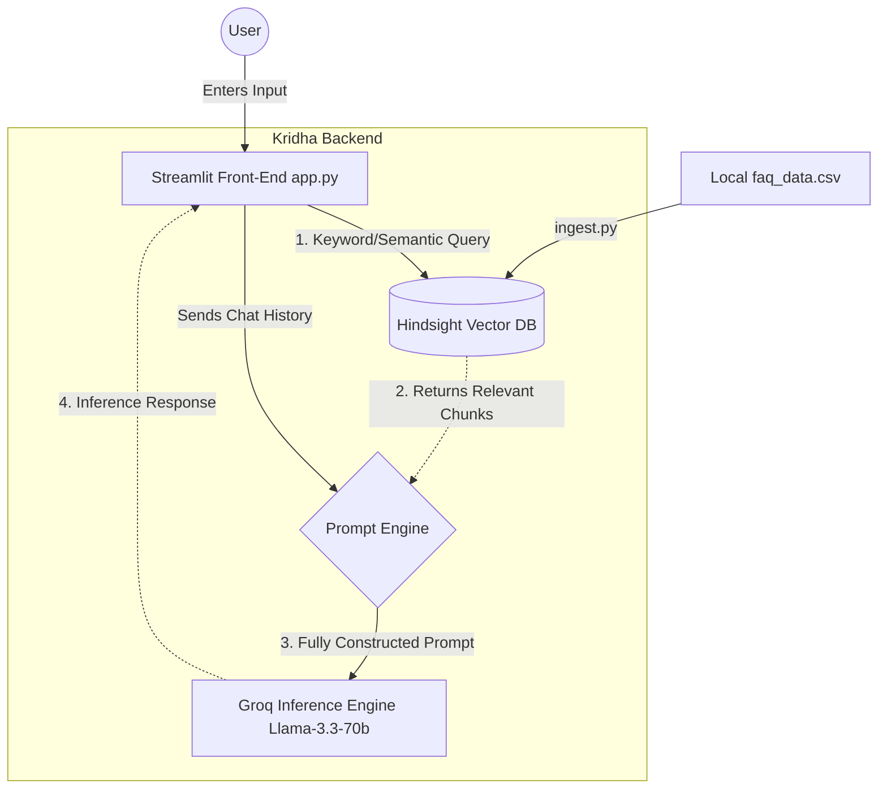

# 🏢 Kridha Workspace AI Agent

Welcome to the **Kridha Workspace AI Agent**, a highly professional, interactive corporate AI assistant built using Streamlit. The agent leverages the high-speed **Groq API** acting as the brain (Llama 3.3 70B), paired with the **Hindsight Vector Database** for fast, reliable RAG (Retrieval-Augmented Generation) contextual memory.

## ✨ Key Features
- **Professional Corporate UI:** Sleek dark-mode glassmorphism interface with smooth fade-in animations and elegant styling.
- **Multiple Session Management:** Keeps track of various chat sessions simultaneously. Easily create a completely isolated "New Chat" and shift between histories via the sidebar.
- **Instant Vector Memory Retrieval:** Fully integrated with `hindsight_client`. Automatically searches the database for specific FAQ knowledge (like return policies, support details) and enriches the prompt invisibly.
- **Context-Aware Memory Tracker:** Passes the entire conversational history dynamically to the LLM (Groq) so the agent never forgets what was said earlier in a session.
- **Exporting Capabilities:** Conversations can be easily exported and saved directly as text files.
- **Quick Action Prompts:** Sidebar options for immediate single-click interactions derived from common FAQs.

---

## 🏗️ System Architecture

The AI agent's architecture follows a classic **Retrieval-Augmented Generation (RAG)** pipeline.



### Component Breakdown
1. **`app.py`:** The primary interface constructed via Streamlit. Manages UI, logic, context concatenation, and the final Groq API inference call.
2. **`ingest.py`:** A data pipeline script. Reads CSV data via Pandas and pushes context entries formatting them into prompts for the Vector DB (Hindsight).
3. **`faq_data.csv`:** The centralized dummy database of facts/data.

---

## 🛠️ Environment Setup & Installation

### 1. Prerequisites
- Python 3.9+
- Pip package manager

### 2. Dependencies
Install the required tools. (If you don't have a `requirements.txt`, you will need at minimum):
```bash
pip install streamlit groq hindsight-client pandas python-dotenv
```

### 3. Environment Secrets (Crucial)
To run this application securely, create a file named **`.env`** in the root directory. Add your secrets inside like this:
```ini
HINDSIGHT_API_KEY=hsk_xxxxxxxxxxx_xxxxx
GROQ_API_KEY=gsk_xxxxxxxxxxxxxxxxxxxx
```
*(Note: Never commit your `.env` file to version control. It is already included in `.gitignore`)*

### 4. Injecting Knowledge Base (Optional)
If you update `faq_data.csv`, run the ingestion script to train the vector database:
```bash
python ingest.py
```

### 5. Running the Agent
Trigger the application locally via Streamlit:
```bash
streamlit run app.py
```
This will spin up your Kridha Workspace at `http://localhost:8501`. 

---

## 👥 Meet the Team Kridha & Insights

Behind the development of **Kridha Workspace** is a dedicated team pushing the boundaries of AI integration in Agritech and supply chain systems. Learn more about our technical architecture, design philosophy, and implementations by reading our articles:

- 👩‍💻 **Kalpana Yadav** | [We Use AI to Create a Transparent Farm-to-Customer System](https://www.linkedin.com/pulse/we-use-ai-create-transparent-farm-to-customer-system-helps-yadav-xvrhc)
- 👨‍💻 **Dushyant Saini** | [Beyond Chatbots: Building Kridha AI Intelligent Agent](https://www.linkedin.com/pulse/beyond-chatbots-building-kridha-ai-intelligent-agent-learns-saini-euamc)
- 👨‍💻 **Mayank Agrawal** | [Building an AI System That Doesn't Forget](https://www.linkedin.com/posts/mayankagrawal27_building-an-ai-system-that-doesnt-forget-ugcPost-7449523430628155392-L4vz?utm_source=share&utm_medium=member_android&rcm=ACoAAF2XZ7kB1WSc_HiRUvaetzWmoVz0B4L2wvw)
- 👩‍💻 **Unnati Gupta** | [Agritech Supply Chain for Farmers](https://www.linkedin.com/posts/unnati-gupta-b91305328_agritech-supplychain-farmers-ugcPost-7449517845861883905-ecj9?utm_source=share&utm_medium=member_android&rcm=ACoAAFKgjF0BZmxmQgc5mYadH8We9eounv6q1dY)
- 👨‍💻 **Kishan Kumar** | [Debugging Supply Chain Systems Using Hindsight Logs](https://www.linkedin.com/pulse/debugging-supply-chain-system-using-hindsight-logs-kishan-nishad-en8dc)

### 🎥 Project Overview Video
Watch a complete demonstration and explanation of Kridha AI in action:
▶️ **[Kridha AI Agent - YouTube Showcase](https://youtu.be/kLrwE3ZRiiA)**

---
*Built with ❤️ utilizing Groq and Streamlit.*
